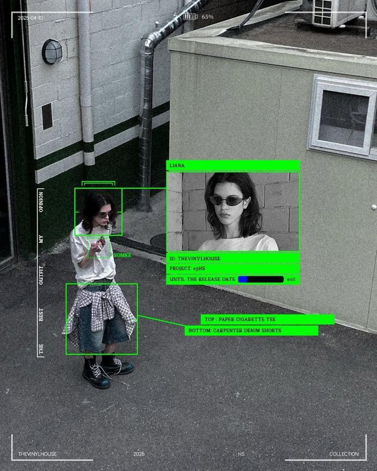

# CCTV Style Photo Editor

A photo editor with a sci-fi surveillance interface that allows you to upload base images and create multiple adjustable detection boxes with connection functionality. Features a black and white metallic design that simulates professional surveillance system visual effects.

## Demo

<div align="center">
  
  
  
</div>

## Features

- 🖼️ **Image Upload**: Support drag & drop or click to upload base images
- 📦 **Multiple Detection Boxes**: Click anywhere on the image to create detection boxes
- 🔧 **Free Adjustment**: Boxes can be freely dragged and resized
- 🔗 **Box Connections**: Drag anchor points to connect different boxes
- 🖼️ **Box Images**: Each box can independently upload images
- 🎨 **Sci-Fi Surveillance Style**: Black and white metallic theme with scan grids, edge rulers, and other surveillance elements
- ⚙️ **Box Property Control**: Adjust box color, text content, and border width
- 💾 **Image Save**: One-click save complete images with all elements
- 📱 **Responsive**: Support for various screen sizes

## Usage

1. **Upload Base Image**: Click the upload area or drag and drop image files
2. **Create Detection Boxes**: Click anywhere on the image to create detection boxes
3. **Adjust Boxes**: 
   - Drag the box body to move position
   - Drag box corners to resize
4. **Box Settings**: Click on a box to open the control panel, where you can adjust:
   - Color: Choose box border color
   - Text: Add text content inside the box
   - Border Width: Adjust border thickness (1-10px)
5. **Box Images**: Hover over a box and click the "+" button to upload images
6. **Box Connections**: Drag anchor points from box edges to another box's anchor points to create connections
7. **Delete Boxes**: Hover over a box and click the delete button in the top-right corner
8. **Save Image**: Click the "💾 SAVE" button to download the complete image with all elements

## Visual Features

- **Sci-Fi Surveillance Style**: Black and white metallic color scheme, simulating professional surveillance systems
- **Scan Grid**: Pulsing grid effect covering the entire image area
- **Edge Rulers**: Measurement rulers on left and right sides, enhancing the tech aesthetic
- **Corner Markers**: L-shaped markers at four corners, simulating surveillance screen borders
- **Control Panel**: Property setting panel that appears when clicking on boxes
- **Animation Effects**: Grid pulse animation creating a surveillance system atmosphere


## Project Setup

```bash
# Install dependencies
npm install

# Start development server
npm run dev

# Build for production
npm run build

# Preview production build
npm run preview
```

## Project Structure

```
src/
├── App.vue              # Main application component
├── components/
│   └── ImageEditor.vue  # Image editor component (main functionality)
├── assets/              # Static assets
└── main.ts             # Application entry point
```

## Main Feature Modules

- **Image Upload Module**: Support drag & drop and click upload
- **Detection Box Management**: Create, adjust, and delete detection boxes
- **Property Control**: Color, text, and border width settings
- **Connection System**: Visual connections between boxes
- **Image Save**: Canvas rendering and image download
- **Surveillance Style**: Sci-fi visual effects and animations

## License

This project is licensed under the MIT License.

## Contributing

Issues and Pull Requests are welcome!

## Author

Roman Lee - [GitHub](https://github.com/romanlee821116)
